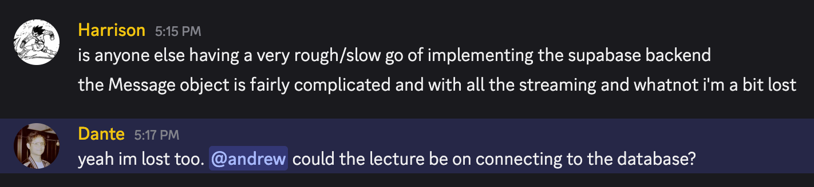
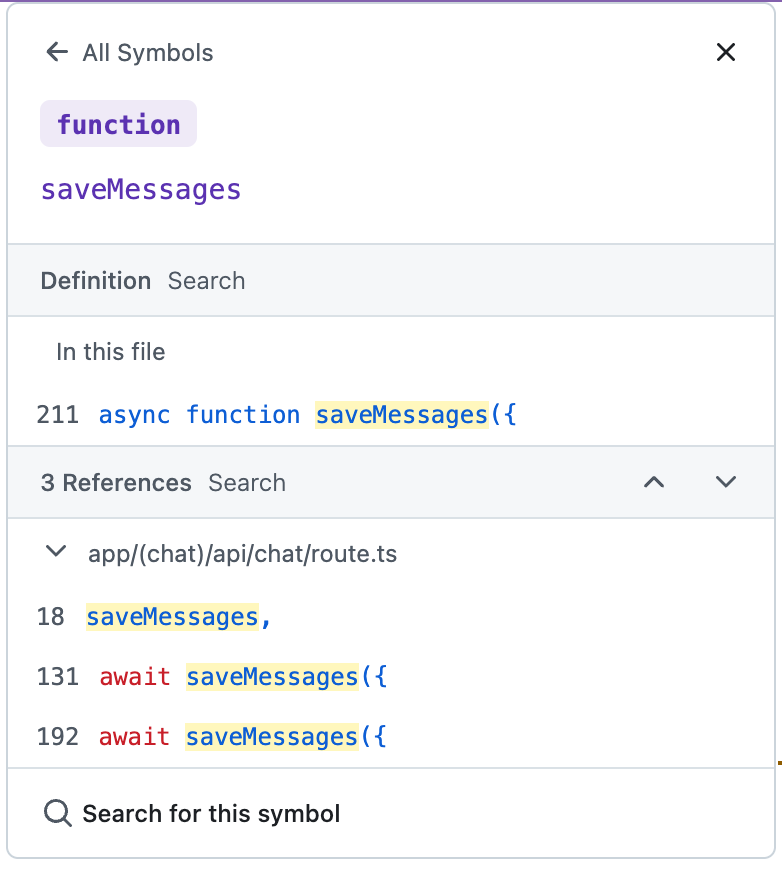

# Chatbot Help

Harrison and Dante Ask:
"How do we persist complex AI messages to our postgres database using the AI SDK?"

Well, instead of answering the question directly, I'm going to show you how to get an answer for yourself. Vercel has a powerful open source template repository called the [Chat SDK](https://chat-sdk.dev/). They also persist their messages using Postgres. If you ever want to see their patterns, you can just look directly at [their Github repo](https://github.com/vercel/ai-chatbot).

That's what we're going to do now.

As a prerequisite to this, you should probably know the basics of [chat persistence](https://ai-sdk.dev/docs/ai-sdk-ui/chatbot-message-persistence), which are covered in Vercel's AI SDK documentation.

1. How does Vercel persist their messages?

There are actually three parts to this question:

1. What is Vercel's postgres schema for storing messages?
2. How does Vercel save the messages to that schema from the SDK format?
3. How does Vercel retrieve those messages and send them back to the client when requesting them?

We'll tackle them each in turn:

## 1. What is Vercel's postgres schema for storing messages?

Search for "schema" in their github and [this file comes up](https://github.com/vercel/ai-chatbot/blob/7d8e71383f55c766ca575da2cac0a8d89283c031/lib/db/schema.ts).

The relevant lines for storing messages are [here](https://github.com/vercel/ai-chatbot/blob/7d8e71383f55c766ca575da2cac0a8d89283c031/lib/db/schema.ts#L50-L59). You'll need to store the messages and also store a Chat for them to reference, so they can be retrieved by chatID when that chat is loaded.

## 2. How does Vercel save the messages to that schema from the SDK format?

By looking at [queries.ts](https://github.com/vercel/ai-chatbot/blob/7d8e71383f55c766ca575da2cac0a8d89283c031/lib/db/queries.ts), we can find a bunch of queries for saving chats, deleting chats, getting chats, saving messages, getting messages, etc...

I'm interested in the [saveMessages query](https://github.com/vercel/ai-chatbot/blob/7d8e71383f55c766ca575da2cac0a8d89283c031/lib/db/queries.ts#L211-L221).

By clicking on the name of the function you can also get all of its references:

This takes us to `app/(chat)/api/chat/route.ts` in the file-based app router. Which corresponds to definitions for the `/api/chat` route handlers.  Remember that the `(chat)` is just a route group, and doesn't affect the actual route where the functions are hosted.

Naturally, because we are interested in SAVING the messages, we want to look at the [POST route handler](https://github.com/vercel/ai-chatbot/blob/7d8e71383f55c766ca575da2cac0a8d89283c031/app/(chat)/api/chat/route.ts#L64)

There are two places where we are saving the messages that the user sends us.

1. [We are performing an initial save when the user sends the message](https://github.com/vercel/ai-chatbot/blob/7d8e71383f55c766ca575da2cac0a8d89283c031/app/(chat)/api/chat/route.ts#L131-L142)
2. [As the AI response streams back, we save the messages in the `onFinish` handler](https://github.com/vercel/ai-chatbot/blob/7d8e71383f55c766ca575da2cac0a8d89283c031/app/(chat)/api/chat/route.ts#L192-L204)

## 3. How does Vercel retrieve the messages and send them back to the client when requested?

TBD